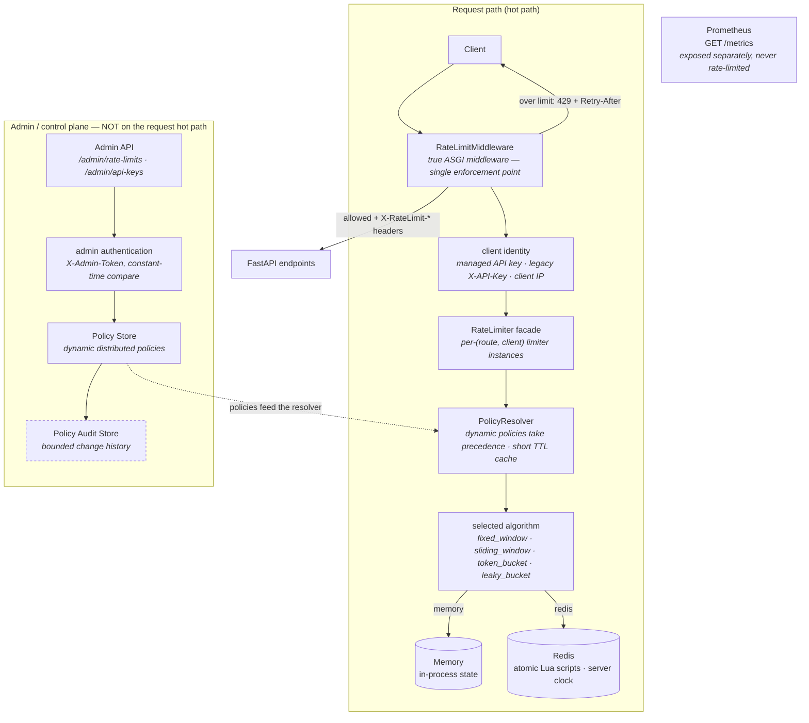
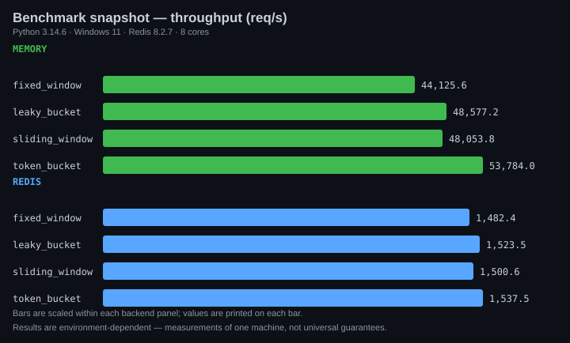

# RateGuard

[](https://github.com/snadeem03/ratelimiter_rategaurd/actions/workflows/ci.yml)
[](https://github.com/snadeem03/ratelimiter_rategaurd/releases)
[](#testing-and-ci)


RateGuard is a **rate-limiting service and library for Python APIs**, built on **FastAPI + Redis**: it enforces limits once at the API boundary inside true ASGI middleware, before requests reach your endpoints.

**Current release:** [v1.2.0](https://github.com/snadeem03/ratelimiter_rategaurd/releases/tag/v1.2.0)

**Key capabilities**

- **4 rate-limiting algorithms** — fixed window, sliding window, token bucket, leaky bucket
- **Memory & Redis backends** — single-process or shared state across workers and hosts
- **True ASGI middleware** — a single enforcement point with standard `X-RateLimit-*` headers and `Retry-After`
- **Dynamic distributed policies** — create/update/delete per-route limits at runtime through an admin API
- **Policy audit history** — atomic, bounded change trail for every policy mutation
- **Prometheus metrics** — `/metrics` endpoint plus a provisioned Grafana dashboard
- **Interactive Playground** — browser UI at `/playground` that drives the real algorithm implementations
- **Benchmark suite** — memory and Redis benchmarks across all four algorithms

## Contents

[Overview](#overview) · [Why RateGuard](#why-rateguard) · [Features](#feature-highlights) · [Architecture](#architecture) · [Algorithms](#algorithms) · [Distributed design](#redis--distributed-design) · [Headers](#rate-limit-headers) · [API keys](#api-key-management) · [Playground](#interactive-playground) · [Quick start](#quick-start) · [Configuration](#configuration) · [Dynamic policies](#dynamic-rate-limit-policies) · [Policy audit history](#policy-audit-history) · [API examples](#api-examples) · [Observability](#observability) · [Benchmarking](#benchmarking) · [Testing & CI](#testing-and-ci) · [Docker](#docker-architecture) · [Security](#security) · [Structure](#project-structure) · [Release](#release)

---

## Overview

RateGuard enforces rate limits at the API boundary **once**, inside a true ASGI middleware — before requests ever reach an endpoint.

- **Four algorithms**: fixed window, sliding window, token bucket, leaky bucket — each implemented twice (in-process memory and Redis).
- **Two backends**: `memory` for single-process apps; `redis` for shared state across multiple Uvicorn workers.
- **Per-client limits** keyed by managed API key, legacy `X-API-Key`, or client IP.
- **Per-route limits** via `RATE_LIMIT_ROUTES=path:limit:window,...`.
- **Managed API keys** (`rg_live_*`): CSPRNG-generated, hash-only storage, admin CRUD.
- **Standard headers** on every response: `X-RateLimit-*`, plus `Retry-After` on 429s.
- **Observability**: Prometheus `/metrics`, provisioned Grafana dashboard.
- **Interactive playground** at `/playground` driving the real algorithm implementations.
- **One-command deployment**: `docker compose up --build` (app + Redis + Prometheus + Grafana).

## Why RateGuard

Naive rate limiters are counters in a dict. They break down exactly where real APIs get hard:

- **Concurrency** — parallel requests race past a non-atomic check-then-increment. Every RateGuard decision is atomic (locks in memory, Lua scripts in Redis).
- **Distributed workers** — production servers run several worker processes; process-local counters let each worker hand out the *full* quota again. With `RATE_LIMIT_BACKEND=redis` all workers share one source of truth.
- **Clock skew** — distributed windows drift if each node trusts its own clock. The Redis implementations use the Redis server clock (`redis.call("TIME")`).
- **Client isolation** — limits must be per identity, not global. RateGuard resolves identity (API key → owner, else IP) and keys every counter by `(route, client)`, so one noisy client can't exhaust anyone else's budget — and `/login` limits never interfere with `/products`.

## Feature highlights

| Algorithm | Memory | Redis | Per-route | Distributed |
|---|:-:|:-:|:-:|:-:|
| Fixed Window   | ✅ | ✅ | ✅ | ✅ |
| Sliding Window | ✅ | ✅ | ✅ | ✅ |
| Token Bucket   | ✅ | ✅ | ✅ | ✅ |
| Leaky Bucket   | ✅ | ✅ | ✅ | ✅ |

Also included:

| Capability | What you get |
|---|---|
| API-key management | `rg_live_*` keys, SHA-256 hashed at rest, one-time secret display, revoke/expire |
| Admin API | `/admin/api-keys` + runtime `/admin/rate-limits` policies, guarded by `X-Admin-Token` (disabled unless configured) |
| Rate-limit headers | `X-RateLimit-Limit/Remaining/Reset` everywhere; `Retry-After` on 429 |
| Playground | Browser UI driving the real algorithms, simulation + live-API modes |
| Observability | Prometheus metrics + auto-provisioned Grafana dashboard |
| Deployment | Multi-service Docker Compose, health-checked, non-root container |
| CI | GitHub Actions: full suite against real Redis, Compose validation, image build |

## Architecture



Excluded from limiting: `/`, `/docs`, `/redoc`, `/openapi.json`, `/metrics`, everything under `/admin/` and `/playground/`. Responses are streamed through untouched — the middleware merges headers without buffering bodies.

## Algorithms

| Algorithm | How it works | Best for | In RateGuard |
|---|---|---|---|
| **Fixed Window** | Counter per `window`; resets when the window rolls over | Cheap, coarse throttling | Counter resets automatically; burst at window edges can admit up to 2× limit |
| **Sliding Window** | Timestamps within the last `window` seconds only | Fair, continuous limiting (default) | No edge bursts; older timestamps expire continuously |
| **Token Bucket** | Bucket of `limit` tokens refilling at `limit/window` per second | Allowing controlled bursts | Bursts up to capacity pass instantly, then sustained refill pacing applies |
| **Leaky Bucket** | FIFO queue draining at a constant `limit/window` rate | Smoothing traffic to constant outflow | Bursts up to capacity queue/pass; a full bucket rejects until a slot drains |

**Token bucket vs leaky bucket** — both tolerate bursts, in opposite directions: the token bucket *spends* pre-accumulated allowance (burst goes out immediately, then refills); the leaky bucket *queues* the burst and releases it at a fixed drain rate. Token bucket shapes the client's sending pattern; leaky bucket shapes what your backend receives.

All four share the same contract: `allow_request()` returns `(allowed, remaining, reset_seconds)` and is safe under concurrency.

<details>
<summary><strong>Redis / distributed design</strong></summary>

Why Redis, and how it stays correct:

- **Shared truth** — one Redis key per `(algorithm, route, client)` means N uvicorn workers enforce one combined budget instead of N separate ones.
- **Atomicity** — every decision (admission, refill/drain, TTL refresh) runs as a single Lua script; concurrent requests cannot oversubscribe the last slot. One round-trip returns `{allowed, remaining, reset}`.
- **Server clock** — scripts read time via `redis.call("TIME")`, so all workers agree regardless of host clock skew. Memory implementations use `time.monotonic()`.
- **TTL cleanup** — every state key carries a TTL (window length or full-drain time, refreshed per request), so idle clients leave no permanent keys.
- **Fail fast, not silent** — with `RATE_LIMIT_BACKEND=redis` the app pings Redis at startup and refuses to boot if it's unreachable; there is no silent fallback to memory. A Redis outage mid-flight fails closed (loud error), never open.
- **Key hygiene** — benchmark and playground runs use namespaced keys and clean them up afterwards.

</details>

## Rate-limit headers

Every response from a rate-limited endpoint carries:

| Header | Meaning |
|---|---|
| `X-RateLimit-Limit` | Max requests per window |
| `X-RateLimit-Remaining` | Requests left in the current window |
| `X-RateLimit-Reset` | Seconds until the budget resets |
| `Retry-After` *(429 only)* | Seconds until a request will succeed again (RFC 6585) |

```http
HTTP/1.1 200 OK
X-RateLimit-Limit: 5
X-RateLimit-Remaining: 3
X-RateLimit-Reset: 42
```

```http
HTTP/1.1 429 Too Many Requests
Retry-After: 43
X-RateLimit-Limit: 5
X-RateLimit-Remaining: 0
X-RateLimit-Reset: 43
```

```json
{"detail": {"retry_after": 43}}
```

## API-key management

- **Send keys** via `X-API-Key`. Keys carry the configured prefix (`rg_live_`) and are generated with a cryptographically secure RNG.
- **Hash-only persistence** — only a SHA-256 digest is stored (JSON file, or a Redis hash with the `redis` backend). The plaintext is shown **once**, in the create response, and never appears in list/get results or logs.
- **Identity semantics** — the rate-limit identity is the key's `owner` (or its digest when no owner). Two keys sharing an owner share a quota; different owners get independent budgets.
- **Validation behavior** — valid/enabled/unexpired key authenticates; missing header falls back to client IP; an explicitly supplied but invalid/disabled/expired key gets `401` (never a silent IP fallback). Non-managed header values keep the legacy opaque-client behavior.
- **Lifecycle** — optional TTL at creation (`ttl` seconds), revocation, and deletion via the admin API.

Admin endpoints require `X-Admin-Token` matching `ADMIN_API_TOKEN` (constant-time comparison). Unset token ⇒ the admin API answers `403` — nothing is publicly accessible by default.

| Endpoint | Purpose |
|---|---|
| `POST /admin/api-keys` | Create a key (secret returned once) |
| `GET /admin/api-keys` | List metadata (no secrets) |
| `POST /admin/api-keys/{id}/revoke` | Disable a key |
| `DELETE /admin/api-keys/{id}` | Delete permanently |

## Interactive playground

Open **[`/playground`](http://localhost:8000/playground)** while the app is running. It's served by RateGuard itself — same origin, no CORS, nothing leaves your machine.

- **Simulation mode** drives the *actual* RateGuard algorithm implementations server-side (via the same factory the API uses) — the browser never re-implements rate limiting. Pick algorithm, limit, window, backend (Memory/Redis), client ID and route, then send single requests or bursts.
- **Live API mode** sends real HTTP requests through the ASGI middleware and visualizes the genuine `X-RateLimit-*` / `Retry-After` headers, including real 429s. Optional API key is sent per request and never persisted.
- **Visualizations per algorithm**: animated fixed-window counter with reset countdown, sliding-window timeline with expiring entries, token-bucket refill/drain, leaky-bucket FIFO queue.
- **Request flow strip** (`Client → Middleware → Limiter → Result`) pulses per request; the live log records status, remaining, reset and full 429 detail; metrics show allowed/rejected/rate/success%.
- Animations respect `prefers-reduced-motion`. Redis unavailability is shown explicitly — never silently downgraded to memory.

## Quick start

```bash
git clone https://github.com/snadeem03/ratelimiter_rategaurd.git
cd ratelimiter_rategaurd
docker compose up --build
```

Wait for healthy services (`docker compose ps`), then open:

| URL | What |
|---|---|
| http://localhost:8000 | API health/info |
| http://localhost:8000/playground | Interactive playground |
| http://localhost:8000/docs | Swagger UI (OpenAPI) |
| http://localhost:8000/metrics | Prometheus exposition |
| http://localhost:3000 | Grafana (provisioned dashboard) |

Compose starts the app only after the Redis health check passes, so the fail-fast backend check succeeds immediately. Stop with `docker compose down`; logs with `docker compose logs -f <service>`.

<details>
<summary><strong>Local Python setup (alternative)</strong></summary>

```powershell
python -m venv venv
.\venv\Scripts\Activate.ps1        # Linux/macOS: source venv/bin/activate
pip install -r requirements.txt
uvicorn app.main:app --reload      # http://127.0.0.1:8000
```

Redis is optional locally — use it only with `RATE_LIMIT_BACKEND=redis`
(e.g. `docker run -p 6379:6379 redis:7-alpine`). For shared limits across
multiple workers: `uvicorn app.main:app --workers 4` with the Redis backend.

</details>

## Configuration

All configuration is environment-based (see [`.env.example`](.env.example)); every variable has a safe default.

| Variable | Default | Description |
|---|---|---|
| `RATE_LIMIT_ALGORITHM` | `sliding_window` | `fixed_window` \| `sliding_window` \| `token_bucket` \| `leaky_bucket` |
| `RATE_LIMIT` | `5` | Global request limit per window (≥ 1) |
| `RATE_LIMIT_WINDOW` | `60` | Window length in seconds (≥ 1) |
| `RATE_LIMIT_ROUTES` | *(empty)* | Per-route overrides: `/api/login:10:60,/api/products:200:60` |
| `RATE_LIMIT_BACKEND` | `memory` | `memory` (per-process) \| `redis` (shared across workers) |
| `REDIS_URL` | `redis://localhost:6379/0` | Redis address (service name `redis` under Compose) |
| `REDIS_PASSWORD` | *(empty)* | Redis auth password |
| `REDIS_SOCKET_TIMEOUT` / `REDIS_SOCKET_CONNECT_TIMEOUT` | `2` | Redis timeouts (seconds) |
| `REDIS_HEALTH_CHECK_INTERVAL` | `30` | Redis health-check interval |
| `ADMIN_API_TOKEN` | *(empty)* | Enables `/admin/api-keys`; empty = disabled (403) |
| `RATE_LIMIT_AUDIT_MAX_EVENTS` | `1000` | Bounded retention for the policy audit trail (≥ 1) |
| `TRUST_PROXY_HEADERS` | `false` | Trust `X-Forwarded-For` only behind a trusted proxy |
| `API_KEY_PREFIX` | `rg_live_` | Managed-key prefix |
| `API_KEY_STORE_PATH` | `api_keys.json` | JSON store path (memory backend) |

Invalid values abort startup with a clear error naming the variable — misconfiguration never surfaces as a runtime failure. Never commit `.env` or real tokens.

## Dynamic Rate-Limit Policies

Route limits can be changed **at runtime** — without restarting RateGuard, its workers, or the Docker stack.

**Static vs runtime configuration.** The environment variables above (`RATE_LIMIT_ROUTES`, `RATE_LIMIT`, `RATE_LIMIT_WINDOW`) are read once at startup and never change while running. On top of them, admins can manage *dynamic policies* per route through the admin API. Effective configuration is resolved per request with this precedence:

```
runtime dynamic policy   (admin API)
        ↓  if none for the route
RATE_LIMIT_ROUTES        (static)
        ↓  if not listed
global RATE_LIMIT / RATE_LIMIT_WINDOW
```

A **disabled** dynamic policy (`enabled: false`) does not block the chain — the route falls back to static/global exactly as if no policy existed. Deleting a policy restores its configured fallback; a route can never be made unlimited by mistake.

### Admin API

All endpoints require `X-Admin-Token` matching `ADMIN_API_TOKEN` (same protection as the API-key admin: missing/wrong/unconfigured token → `403`). Routes contain `/`, so URL paths use the full route suffix:

> **Windows PowerShell:** `curl` may resolve to PowerShell's own web-request command depending on your environment. Use the PowerShell examples below, or invoke native curl explicitly as `curl.exe`. Multiline PowerShell continues with a backtick (`` ` ``), not Bash's `\`.

```bash
# List every route with its effective limit and where it comes from
curl http://localhost:8000/admin/rate-limits \
  -H "X-Admin-Token: <ADMIN_API_TOKEN>"

# Create a policy (409 if one already exists for the route)
curl -X POST http://localhost:8000/admin/rate-limits \
  -H "X-Admin-Token: <ADMIN_API_TOKEN>" \
  -H "Content-Type: application/json" \
  -d '{"route":"/api/orders","limit":30,"window":60}'

# Update it (partial updates allowed; 404 if no dynamic policy exists)
curl -X PUT http://localhost:8000/admin/rate-limits/api/orders \
  -H "X-Admin-Token: <ADMIN_API_TOKEN>" \
  -H "Content-Type: application/json" \
  -d '{"limit":50}'

# Remove it — /api/orders returns to its configured fallback
curl -X DELETE http://localhost:8000/admin/rate-limits/api/orders \
  -H "X-Admin-Token: <ADMIN_API_TOKEN>"
```

The same operations in PowerShell (`$headers` is reused by every example):

```powershell
# Shared by all admin examples below
$headers = @{
    "X-Admin-Token" = "<ADMIN_API_TOKEN>"
    "Content-Type"  = "application/json"
}

# List every route with its effective limit and where it comes from
Invoke-RestMethod `
    -Uri "http://localhost:8000/admin/rate-limits" `
    -Headers $headers

# Create a policy (409 if one already exists for the route)
$body = @{
    route   = "/api/orders"
    limit   = 30
    window  = 60
    enabled = $true
} | ConvertTo-Json

Invoke-RestMethod `
    -Uri "http://localhost:8000/admin/rate-limits" `
    -Method Post `
    -Headers $headers `
    -Body $body

# Update it (partial updates allowed; 404 if no dynamic policy exists)
$body = @{ limit = 50 } | ConvertTo-Json

Invoke-RestMethod `
    -Uri "http://localhost:8000/admin/rate-limits/api/orders" `
    -Method Put `
    -Headers $headers `
    -Body $body

# Remove it — /api/orders returns to its configured fallback (204)
Invoke-RestMethod `
    -Uri "http://localhost:8000/admin/rate-limits/api/orders" `
    -Method Delete `
    -Headers $headers
```

Malformed policies are rejected with `422`: routes must be safe exact-match paths (leading `/`, no `.`, `..`, whitespace or control characters), `limit`/`window` must be integers ≥ 1, duplicates rejected on create.

### Policy update behavior

Updates take effect on subsequent requests immediately on the worker that handled the update, and within **2 seconds** (cache TTL) on every other worker — no restarts anywhere.

Existing rate-limit state is **preserved**, never wiped:

- raising `/api/orders` from 5/min to 10/min lets exactly five more requests through in the current window;
- tightening back to 5/min rejects immediately until in-window requests age out;
- token buckets keep their drained tokens (only refill pacing recovers); leaky buckets gain free queue slots when capacity grows.

This is enforced by re-tuning live limiter instances (limit/window/capacity/rate) rather than deleting algorithm state.

### Redis synchronization

With `RATE_LIMIT_BACKEND=redis`, policies live in Redis under `rateguard:policy:<route>` (JSON documents written atomically via `SET`; an index set tracks all routes). Every uvicorn worker reads the same state, updates propagate to all of them, and policies survive container restarts. Readers only ever see complete documents — concurrent updates cannot surface partial data.

With the default `memory` backend, policies are stored **in-process**: they are visible only to the single process that created them, are NOT shared between multiple workers, and do not survive a restart. Memory mode does not provide distributed configuration.

If Redis becomes unavailable, policy operations return `503 {"error": "Redis unavailable"}` and enforcement fails closed — rate limiting never gets bypassed because policy storage is down.

### Observability

Policy management increments `rateguard_policy_updates_total{operation,outcome}` (bounded labels: `set|delete|list|read × success|error`). Route paths are never used as metric labels.

## Policy Audit History

Every successful dynamic policy mutation through the admin API records one **immutable audit event** — an append-only change trail, not a logging system. The rate-limit hot path never reads it; current policy behavior stays entirely with the existing policy store/resolver.

**What is recorded** (exactly these fields, nothing else):

```json
{
  "event_id": "9f1c…",            // random UUID — unique, not sequential
  "timestamp": "2026-08-23T02:01:18.123456+00:00",
  "operation": "update",          // create | update | delete
  "route": "/api/orders",
  "previous_policy": {"route":"/api/orders","limit":30,"window":60,"enabled":true},
  "new_policy": {"route":"/api/orders","limit":50,"window":60,"enabled":true},
  "actor": "admin"
}
```

- `create` → `previous_policy: null`; `delete` → `new_policy: null`. Toggling `enabled` appears as an ordinary `update` whose before/after snapshots show the flip.
- **Who** — the actor is the fixed identifier `"admin"` (the admin surface has a single shared token identity). The token itself is **never stored or echoed** anywhere in audit data.
- **Retention** — bounded to the newest `RATE_LIMIT_AUDIT_MAX_EVENTS` events (default `1000`); once full, the oldest events are discarded. No archival, no export pipeline.

### Access

```bash
# Recent events, newest first (limit ≤ 500; optional route/operation filters)
curl "http://localhost:8000/admin/rate-limits/audit?limit=20&operation=update" \
  -H "X-Admin-Token: <ADMIN_API_TOKEN>"

curl "http://localhost:8000/admin/rate-limits/audit?route=/api/orders" \
  -H "X-Admin-Token: <ADMIN_API_TOKEN>"
```

PowerShell:

```powershell
$headers = @{ "X-Admin-Token" = "<ADMIN_API_TOKEN>" }

# Recent events, newest first (limit ≤ 500; optional route/operation filters)
Invoke-RestMethod `
    -Uri "http://localhost:8000/admin/rate-limits/audit?limit=20&operation=update" `
    -Headers $headers

Invoke-RestMethod `
    -Uri "http://localhost:8000/admin/rate-limits/audit?route=/api/orders" `
    -Headers $headers
```

Same protection as every admin endpoint: missing/wrong/unconfigured `X-Admin-Token` → `403`. Responses contain no tokens, API keys, hashes, credentials, or client IPs.

### Redis vs memory

| Backend | Behavior |
|---|---|
| `redis` | One Redis Stream (`rateguard:audit:policies`) shared by **all workers and hosts**; history survives restarts as long as Redis data persists. |
| `memory` | Bounded in-process deque: **process-local, ephemeral, not shared between workers, lost on restart**. Memory mode provides no distributed audit history. |

**Atomicity & failure semantics** — on Redis, the policy write and its audit event are one Lua-script execution: a mutation can never succeed while its event is silently lost, and a recorded `previous_policy` is always the document that was actually replaced. If recording fails, the whole mutation fails closed (`503`) with **no state change**. Ordinary rate-limited requests are unaffected by any audit problem.

Audit events also increment `rateguard_policy_audit_events_total{operation,outcome}` (bounded labels: `create|update|delete × success|error`).

> This is a lightweight operational trail for answering *what changed, when, by whom*. It is not a compliance/audit platform — no tamper-proofing beyond Redis persistence, no export, no user attribution beyond the single shared admin identity.

## API examples

```bash
# Normal rate-limited request (identity = your IP)
curl -i http://localhost:8000/api/test

# Past the limit -> 429 with Retry-After
# (repeat the call ~6 times with the default config)

# Authenticated request (managed key)
curl -i http://localhost:8000/api/test -H "X-API-Key: rg_live_your_key_here"

# Route-specific limits: start with overrides, then hit both routes
RATE_LIMIT_ROUTES=/api/login:10:60,/api/products:200:60
# /api/login allows 10/min, /api/products allows 200/min — independent budgets

# Admin API (placeholder token; set ADMIN_API_TOKEN first)
curl -X POST http://localhost:8000/admin/api-keys \
  -H "X-Admin-Token: $ADMIN_API_TOKEN" \
  -H "Content-Type: application/json" \
  -d '{"name":"my-app","owner":"acme","ttl":3600}'
```

## Observability

`GET /metrics` exposes Prometheus-format metrics (never rate-limited, consumes no budget):

| Metric | Type | Labels |
|---|---|---|
| `rateguard_http_requests_total` | counter | `route`, `status` |
| `rateguard_rate_limit_requests_total` | counter | `decision`, `algorithm`, `backend`, `route` |
| `rateguard_http_request_duration_seconds` | histogram | `route` (avg/p50/p95/p99) |
| `rateguard_rate_limit_utilization` | gauge | `route` |
| `rateguard_policy_updates_total` | counter | `operation`, `outcome` |
| `rateguard_policy_audit_events_total` | counter | `operation`, `outcome` |

- **Cardinality safety** — labels are strictly bounded; unknown paths aggregate under `other`. API keys, client IDs and IPs are never labels; there are no per-client series.
- **Multi-worker aggregation** — set `PROMETHEUS_MULTIPROC_DIR` (the provided compose stack does) so one scrape sees all workers' counters.
- **Zero hot-path cost** — metrics add no Redis round-trips.
- **Grafana** — the bundled stack provisions the datasource and a *RateGuard Overview* dashboard (requests, allowed/rejected, rejection rate, decisions by algorithm/backend, latency percentiles, utilization per route). Grafana credentials come from `GRAFANA_ADMIN_USER`/`GRAFANA_ADMIN_PASSWORD` (local-dev defaults, override before exposing).

## Benchmarking

The `benchmark/` package drives the **real** limiter implementations (no mocks) across algorithms × backends × traffic patterns × concurrency levels:

```bash
python -m benchmark.benchmark                                  # memory, all algorithms, burst
python -m benchmark.benchmark --backend redis                  # Redis-backed
python -m benchmark.benchmark --backend both --traffic all --concurrency all
python -m benchmark.benchmark --backend redis --algorithm token_bucket \
    --traffic burst --requests 1000 --concurrency 10
```

- **Traffic patterns** — `normal` (half sustainable rate), `burst` (rapid-fire), `sustained` (exactly at rate).
- **Correctness gate** — every scenario verifies on a fresh limiter that exactly `limit` requests pass before timing anything.
- **Metrics** — RPS, allowed/rejected counts, avg/p50/p95/p99 latency of `allow_request()`.
- **Output** — table, CSV, JSON (saved under `benchmark/results/`).
- **Isolation** — unique `run_id`-scoped Redis keys, deleted after each run.

Numbers depend heavily on hardware and topology, so this README deliberately publishes none — run it yourself.

### v1.2 benchmark suite (`benchmarks/`)

A leaner matrix runner over the same real limiter implementations. All **four algorithms** are benchmarked against the **memory** and **Redis** backends (8 scenarios total), sequentially, with per-request `perf_counter()` timing:

```bash
python -m benchmarks.run --backend memory --algorithm token_bucket --requests 1000 --concurrency 1
python -m benchmarks.run --all --requests 1000 --concurrency 10
python -m benchmarks.run --all --requests 1000 --concurrency 10 --output benchmark-results.json
```

- Redis must be reachable for `--backend redis`; an unreachable server fails clearly instead of skipping or falling back.
- Each run uses a unique key namespace (`rateguard:{algorithm}:bench:{run_id}`); only those keys are deleted afterwards.
- `--output` writes a JSON report (timestamp, environment info, configuration, results). No file is created without it.
- Results depend heavily on hardware, Python version, where Redis runs, and system load — they are measurements of your machine, not universal performance guarantees. Treat every number in this README (including the snapshot below) as one data point; generate your own.

#### Benchmark snapshot

Throughput (req/s) from a single verified run of the command above (`--all --requests 1000 --concurrency 1`, Python 3.14 · Windows 11 · Redis 8.2.7 · 8 cores). Bars are scaled within each backend panel — always compare values, not bar widths across panels:



Numbers are environment-dependent measurements of one machine, not universal guarantees or production predictions. Regenerate the chart from your own run:

```bash
python -m benchmarks.run --all --requests 1000 --concurrency 1 --output benchmark-results.json
python -m benchmarks.chart benchmark-results.json docs/benchmark-throughput.svg
```

## Testing and CI

```bash
python -m pytest -v     # 468 tests
```

- Redis-backed tests execute against a **real Redis** and skip cleanly when none is running locally.
- GitHub Actions ([`ci.yml`](.github/workflows/ci.yml)) runs on pushes/PRs to `main`: the full suite on Python 3.12 against a `redis:7-alpine` service container (skips fail the job), plus `docker compose config` validation and an image build.

## Docker architecture

| Service | Image | Ports | Role |
|---|---|---|---|
| `rategaurd` | built from `Dockerfile` | `8000:8000` | FastAPI app, 2 uvicorn workers, non-root user, health-checked |
| `redis` | `redis:7-alpine` | **internal only** | Shared rate-limit state |
| `prometheus` | `prom/prometheus:v3.4.1` | internal only | Scrapes `rategaurd:8000/metrics` |
| `grafana` | `grafana/grafana:11.6.0` | `3000:3000` | Provisioned dashboards |

Redis and Prometheus are reachable only on the Compose network — never published to the host.

## Security

- API keys generated with a CSPRNG (`secrets` module); only SHA-256 digests stored; secrets shown exactly once, never logged.
- Admin API off by default; token compared in constant time (byte-safe against malformed input).
- `X-Forwarded-For` honored only when `TRUST_PROXY_HEADERS=true` — prevents identity spoofing outside a trusted proxy.
- Invalid/non-positive configuration aborts startup instead of failing at request time.
- Non-root container user; Redis/Prometheus not exposed publicly; `.env` and key stores gitignored; no secrets in repository history.
- Bounded metric labels prevent cardinality attacks and data leakage.

## Project structure

```
app/
  main.py                     # FastAPI app, wiring, endpoints, admin API
  config.py                   # env parsing + route-limit parsing
  api_keys.py                 # ApiKeyStore (JSON) / RedisApiKeyStore
  core/                       # config-driven Redis client
  middleware/                 # ASGI RateLimitMiddleware + RateLimiter facade
  algorithms/                 # 4 algorithms × (memory, Redis/Lua)
  storage/                    # Redis wrapper + key builders
  playground/                 # simulation engine (real algorithms)
  static/                     # playground frontend
prometheus/, grafana/         # observability provisioning
tests/                        # 468 tests
benchmark/                    # CLI benchmark system
Dockerfile, docker-compose.yml
.env.example                  # safe configuration template
```

## Release

**RateGuard v1.1.0** — see [releases](https://github.com/snadeem03/ratelimiter_rategaurd/releases). A production-oriented rate-limiting service for local development, testing, and deployment. v1.1.0 adds dynamic distributed rate-limit policies (runtime CRUD via the admin API with bounded cross-worker convergence) and an append-only policy audit history with bounded retention and atomic policy+audit persistence on Redis; distributed enforcement, startup-fail-fast configuration, hardened admin auth, and the full test suite remain verified in CI.

## Future work

Short list of genuinely planned items (not commitments):

- Per-algorithm header tuning (e.g. bucket-specific reset semantics)
- Distributed multi-host benchmark orchestration
- Optional clustered-Redis guidance beyond single-node deployments
