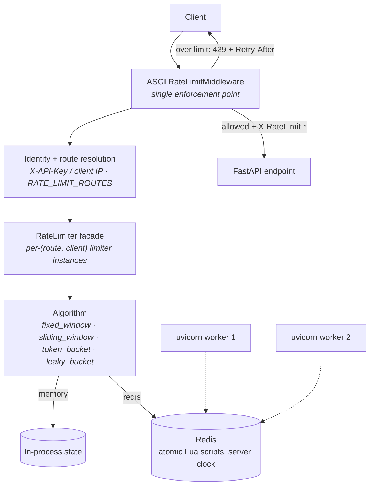

# RateGuard

[](https://github.com/snadeem03/ratelimiter_rategaurd/actions/workflows/ci.yml)
[](https://github.com/snadeem03/ratelimiter_rategaurd/releases)


A distributed API rate-limiting service built with **FastAPI + Redis** — four pluggable algorithms, two backends, per-client and per-route limits, managed API keys, Prometheus metrics, and an interactive playground.

## Contents

[Overview](#overview) · [Why RateGuard](#why-rateguard) · [Features](#feature-highlights) · [Architecture](#architecture) · [Algorithms](#algorithms) · [Distributed design](#redis--distributed-design) · [Headers](#rate-limit-headers) · [API keys](#api-key-management) · [Playground](#interactive-playground) · [Quick start](#quick-start) · [Configuration](#configuration) · [API examples](#api-examples) · [Observability](#observability) · [Benchmarking](#benchmarking) · [Testing & CI](#testing-and-ci) · [Docker](#docker-architecture) · [Security](#security) · [Structure](#project-structure) · [Release](#release)

---

## Overview

RateGuard enforces rate limits at the API boundary **once**, inside a true ASGI middleware — before requests ever reach an endpoint.

- **Four algorithms**: fixed window, sliding window, token bucket, leaky bucket — each implemented twice (in-process memory and Redis).
- **Two backends**: `memory` for single-process apps; `redis` for shared state across multiple Uvicorn workers.
- **Per-client limits** keyed by managed API key, legacy `X-API-Key`, or client IP.
- **Per-route limits** via `RATE_LIMIT_ROUTES=path:limit:window,...`.
- **Managed API keys** (`rg_live_*`): CSPRNG-generated, hash-only storage, admin CRUD.
- **Standard headers** on every response: `X-RateLimit-*`, plus `Retry-After` on 429s.
- **Observability**: Prometheus `/metrics`, provisioned Grafana dashboard.
- **Interactive playground** at `/playground` driving the real algorithm implementations.
- **One-command deployment**: `docker compose up --build` (app + Redis + Prometheus + Grafana).

## Why RateGuard

Naive rate limiters are counters in a dict. They break down exactly where real APIs get hard:

- **Concurrency** — parallel requests race past a non-atomic check-then-increment. Every RateGuard decision is atomic (locks in memory, Lua scripts in Redis).
- **Distributed workers** — production servers run several worker processes; process-local counters let each worker hand out the *full* quota again. With `RATE_LIMIT_BACKEND=redis` all workers share one source of truth.
- **Clock skew** — distributed windows drift if each node trusts its own clock. The Redis implementations use the Redis server clock (`redis.call("TIME")`).
- **Client isolation** — limits must be per identity, not global. RateGuard resolves identity (API key → owner, else IP) and keys every counter by `(route, client)`, so one noisy client can't exhaust anyone else's budget — and `/login` limits never interfere with `/products`.

## Feature highlights

| Algorithm | Memory | Redis | Per-route | Distributed |
|---|:-:|:-:|:-:|:-:|
| Fixed Window   | ✅ | ✅ | ✅ | ✅ |
| Sliding Window | ✅ | ✅ | ✅ | ✅ |
| Token Bucket   | ✅ | ✅ | ✅ | ✅ |
| Leaky Bucket   | ✅ | ✅ | ✅ | ✅ |

Also included:

| Capability | What you get |
|---|---|
| API-key management | `rg_live_*` keys, SHA-256 hashed at rest, one-time secret display, revoke/expire |
| Admin API | `/admin/api-keys` CRUD guarded by `X-Admin-Token` (disabled unless configured) |
| Rate-limit headers | `X-RateLimit-Limit/Remaining/Reset` everywhere; `Retry-After` on 429 |
| Playground | Browser UI driving the real algorithms, simulation + live-API modes |
| Observability | Prometheus metrics + auto-provisioned Grafana dashboard |
| Deployment | Multi-service Docker Compose, health-checked, non-root container |
| CI | GitHub Actions: full suite against real Redis, Compose validation, image build |

## Architecture



Excluded from limiting: `/`, `/docs`, `/redoc`, `/openapi.json`, `/metrics`, everything under `/admin/` and `/playground/`. Responses are streamed through untouched — the middleware merges headers without buffering bodies.

## Algorithms

| Algorithm | How it works | Best for | In RateGuard |
|---|---|---|---|
| **Fixed Window** | Counter per `window`; resets when the window rolls over | Cheap, coarse throttling | Counter resets automatically; burst at window edges can admit up to 2× limit |
| **Sliding Window** | Timestamps within the last `window` seconds only | Fair, continuous limiting (default) | No edge bursts; older timestamps expire continuously |
| **Token Bucket** | Bucket of `limit` tokens refilling at `limit/window` per second | Allowing controlled bursts | Bursts up to capacity pass instantly, then sustained refill pacing applies |
| **Leaky Bucket** | FIFO queue draining at a constant `limit/window` rate | Smoothing traffic to constant outflow | Bursts up to capacity queue/pass; a full bucket rejects until a slot drains |

**Token bucket vs leaky bucket** — both tolerate bursts, in opposite directions: the token bucket *spends* pre-accumulated allowance (burst goes out immediately, then refills); the leaky bucket *queues* the burst and releases it at a fixed drain rate. Token bucket shapes the client's sending pattern; leaky bucket shapes what your backend receives.

All four share the same contract: `allow_request()` returns `(allowed, remaining, reset_seconds)` and is safe under concurrency.

<details>
<summary><strong>Redis / distributed design</strong></summary>

Why Redis, and how it stays correct:

- **Shared truth** — one Redis key per `(algorithm, route, client)` means N uvicorn workers enforce one combined budget instead of N separate ones.
- **Atomicity** — every decision (admission, refill/drain, TTL refresh) runs as a single Lua script; concurrent requests cannot oversubscribe the last slot. One round-trip returns `{allowed, remaining, reset}`.
- **Server clock** — scripts read time via `redis.call("TIME")`, so all workers agree regardless of host clock skew. Memory implementations use `time.monotonic()`.
- **TTL cleanup** — every state key carries a TTL (window length or full-drain time, refreshed per request), so idle clients leave no permanent keys.
- **Fail fast, not silent** — with `RATE_LIMIT_BACKEND=redis` the app pings Redis at startup and refuses to boot if it's unreachable; there is no silent fallback to memory. A Redis outage mid-flight fails closed (loud error), never open.
- **Key hygiene** — benchmark and playground runs use namespaced keys and clean them up afterwards.

</details>

## Rate-limit headers

Every response from a rate-limited endpoint carries:

| Header | Meaning |
|---|---|
| `X-RateLimit-Limit` | Max requests per window |
| `X-RateLimit-Remaining` | Requests left in the current window |
| `X-RateLimit-Reset` | Seconds until the budget resets |
| `Retry-After` *(429 only)* | Seconds until a request will succeed again (RFC 6585) |

```http
HTTP/1.1 200 OK
X-RateLimit-Limit: 5
X-RateLimit-Remaining: 3
X-RateLimit-Reset: 42
```

```http
HTTP/1.1 429 Too Many Requests
Retry-After: 43
X-RateLimit-Limit: 5
X-RateLimit-Remaining: 0
X-RateLimit-Reset: 43
```

```json
{"detail": {"retry_after": 43}}
```

## API-key management

- **Send keys** via `X-API-Key`. Keys carry the configured prefix (`rg_live_`) and are generated with a cryptographically secure RNG.
- **Hash-only persistence** — only a SHA-256 digest is stored (JSON file, or a Redis hash with the `redis` backend). The plaintext is shown **once**, in the create response, and never appears in list/get results or logs.
- **Identity semantics** — the rate-limit identity is the key's `owner` (or its digest when no owner). Two keys sharing an owner share a quota; different owners get independent budgets.
- **Validation behavior** — valid/enabled/unexpired key authenticates; missing header falls back to client IP; an explicitly supplied but invalid/disabled/expired key gets `401` (never a silent IP fallback). Non-managed header values keep the legacy opaque-client behavior.
- **Lifecycle** — optional TTL at creation (`ttl` seconds), revocation, and deletion via the admin API.

Admin endpoints require `X-Admin-Token` matching `ADMIN_API_TOKEN` (constant-time comparison). Unset token ⇒ the admin API answers `403` — nothing is publicly accessible by default.

| Endpoint | Purpose |
|---|---|
| `POST /admin/api-keys` | Create a key (secret returned once) |
| `GET /admin/api-keys` | List metadata (no secrets) |
| `POST /admin/api-keys/{id}/revoke` | Disable a key |
| `DELETE /admin/api-keys/{id}` | Delete permanently |

## Interactive playground

Open **[`/playground`](http://localhost:8000/playground)** while the app is running. It's served by RateGuard itself — same origin, no CORS, nothing leaves your machine.

- **Simulation mode** drives the *actual* RateGuard algorithm implementations server-side (via the same factory the API uses) — the browser never re-implements rate limiting. Pick algorithm, limit, window, backend (Memory/Redis), client ID and route, then send single requests or bursts.
- **Live API mode** sends real HTTP requests through the ASGI middleware and visualizes the genuine `X-RateLimit-*` / `Retry-After` headers, including real 429s. Optional API key is sent per request and never persisted.
- **Visualizations per algorithm**: animated fixed-window counter with reset countdown, sliding-window timeline with expiring entries, token-bucket refill/drain, leaky-bucket FIFO queue.
- **Request flow strip** (`Client → Middleware → Limiter → Result`) pulses per request; the live log records status, remaining, reset and full 429 detail; metrics show allowed/rejected/rate/success%.
- Animations respect `prefers-reduced-motion`. Redis unavailability is shown explicitly — never silently downgraded to memory.

## Quick start

```bash
git clone https://github.com/snadeem03/ratelimiter_rategaurd.git
cd ratelimiter_rategaurd
docker compose up --build
```

Wait for healthy services (`docker compose ps`), then open:

| URL | What |
|---|---|
| http://localhost:8000 | API health/info |
| http://localhost:8000/playground | Interactive playground |
| http://localhost:8000/docs | Swagger UI (OpenAPI) |
| http://localhost:8000/metrics | Prometheus exposition |
| http://localhost:3000 | Grafana (provisioned dashboard) |

Compose starts the app only after the Redis health check passes, so the fail-fast backend check succeeds immediately. Stop with `docker compose down`; logs with `docker compose logs -f <service>`.

<details>
<summary><strong>Local Python setup (alternative)</strong></summary>

```powershell
python -m venv venv
.\venv\Scripts\Activate.ps1        # Linux/macOS: source venv/bin/activate
pip install -r requirements.txt
uvicorn app.main:app --reload      # http://127.0.0.1:8000
```

Redis is optional locally — use it only with `RATE_LIMIT_BACKEND=redis`
(e.g. `docker run -p 6379:6379 redis:7-alpine`). For shared limits across
multiple workers: `uvicorn app.main:app --workers 4` with the Redis backend.

</details>

## Configuration

All configuration is environment-based (see [`.env.example`](.env.example)); every variable has a safe default.

| Variable | Default | Description |
|---|---|---|
| `RATE_LIMIT_ALGORITHM` | `sliding_window` | `fixed_window` \| `sliding_window` \| `token_bucket` \| `leaky_bucket` |
| `RATE_LIMIT` | `5` | Global request limit per window (≥ 1) |
| `RATE_LIMIT_WINDOW` | `60` | Window length in seconds (≥ 1) |
| `RATE_LIMIT_ROUTES` | *(empty)* | Per-route overrides: `/api/login:10:60,/api/products:200:60` |
| `RATE_LIMIT_BACKEND` | `memory` | `memory` (per-process) \| `redis` (shared across workers) |
| `REDIS_URL` | `redis://localhost:6379/0` | Redis address (service name `redis` under Compose) |
| `REDIS_PASSWORD` | *(empty)* | Redis auth password |
| `REDIS_SOCKET_TIMEOUT` / `REDIS_SOCKET_CONNECT_TIMEOUT` | `2` | Redis timeouts (seconds) |
| `REDIS_HEALTH_CHECK_INTERVAL` | `30` | Redis health-check interval |
| `ADMIN_API_TOKEN` | *(empty)* | Enables `/admin/api-keys`; empty = disabled (403) |
| `TRUST_PROXY_HEADERS` | `false` | Trust `X-Forwarded-For` only behind a trusted proxy |
| `API_KEY_PREFIX` | `rg_live_` | Managed-key prefix |
| `API_KEY_STORE_PATH` | `api_keys.json` | JSON store path (memory backend) |

Invalid values abort startup with a clear error naming the variable — misconfiguration never surfaces as a runtime failure. Never commit `.env` or real tokens.

## API examples

```bash
# Normal rate-limited request (identity = your IP)
curl -i http://localhost:8000/api/test

# Past the limit -> 429 with Retry-After
# (repeat the call ~6 times with the default config)

# Authenticated request (managed key)
curl -i http://localhost:8000/api/test -H "X-API-Key: rg_live_your_key_here"

# Route-specific limits: start with overrides, then hit both routes
RATE_LIMIT_ROUTES=/api/login:10:60,/api/products:200:60
# /api/login allows 10/min, /api/products allows 200/min — independent budgets

# Admin API (placeholder token; set ADMIN_API_TOKEN first)
curl -X POST http://localhost:8000/admin/api-keys \
  -H "X-Admin-Token: $ADMIN_API_TOKEN" \
  -H "Content-Type: application/json" \
  -d '{"name":"my-app","owner":"acme","ttl":3600}'
```

## Observability

`GET /metrics` exposes Prometheus-format metrics (never rate-limited, consumes no budget):

| Metric | Type | Labels |
|---|---|---|
| `rateguard_http_requests_total` | counter | `route`, `status` |
| `rateguard_rate_limit_requests_total` | counter | `decision`, `algorithm`, `backend`, `route` |
| `rateguard_http_request_duration_seconds` | histogram | `route` (avg/p50/p95/p99) |
| `rateguard_rate_limit_utilization` | gauge | `route` |

- **Cardinality safety** — labels are strictly bounded; unknown paths aggregate under `other`. API keys, client IDs and IPs are never labels; there are no per-client series.
- **Multi-worker aggregation** — set `PROMETHEUS_MULTIPROC_DIR` (the provided compose stack does) so one scrape sees all workers' counters.
- **Zero hot-path cost** — metrics add no Redis round-trips.
- **Grafana** — the bundled stack provisions the datasource and a *RateGuard Overview* dashboard (requests, allowed/rejected, rejection rate, decisions by algorithm/backend, latency percentiles, utilization per route). Grafana credentials come from `GRAFANA_ADMIN_USER`/`GRAFANA_ADMIN_PASSWORD` (local-dev defaults, override before exposing).

## Benchmarking

The `benchmark/` package drives the **real** limiter implementations (no mocks) across algorithms × backends × traffic patterns × concurrency levels:

```bash
python -m benchmark.benchmark                                  # memory, all algorithms, burst
python -m benchmark.benchmark --backend redis                  # Redis-backed
python -m benchmark.benchmark --backend both --traffic all --concurrency all
python -m benchmark.benchmark --backend redis --algorithm token_bucket \
    --traffic burst --requests 1000 --concurrency 10
```

- **Traffic patterns** — `normal` (half sustainable rate), `burst` (rapid-fire), `sustained` (exactly at rate).
- **Correctness gate** — every scenario verifies on a fresh limiter that exactly `limit` requests pass before timing anything.
- **Metrics** — RPS, allowed/rejected counts, avg/p50/p95/p99 latency of `allow_request()`.
- **Output** — table, CSV, JSON (saved under `benchmark/results/`).
- **Isolation** — unique `run_id`-scoped Redis keys, deleted after each run.

Numbers depend heavily on hardware and topology, so this README deliberately publishes none — run it yourself.

## Testing and CI

```bash
python -m pytest -v     # 323 tests
```

- Redis-backed tests execute against a **real Redis** and skip cleanly when none is running locally.
- GitHub Actions ([`ci.yml`](.github/workflows/ci.yml)) runs on pushes/PRs to `main`: the full suite on Python 3.12 against a `redis:7-alpine` service container (skips fail the job), plus `docker compose config` validation and an image build.

## Docker architecture

| Service | Image | Ports | Role |
|---|---|---|---|
| `rategaurd` | built from `Dockerfile` | `8000:8000` | FastAPI app, 2 uvicorn workers, non-root user, health-checked |
| `redis` | `redis:7-alpine` | **internal only** | Shared rate-limit state |
| `prometheus` | `prom/prometheus:v3.4.1` | internal only | Scrapes `rategaurd:8000/metrics` |
| `grafana` | `grafana/grafana:11.6.0` | `3000:3000` | Provisioned dashboards |

Redis and Prometheus are reachable only on the Compose network — never published to the host.

## Security

- API keys generated with a CSPRNG (`secrets` module); only SHA-256 digests stored; secrets shown exactly once, never logged.
- Admin API off by default; token compared in constant time (byte-safe against malformed input).
- `X-Forwarded-For` honored only when `TRUST_PROXY_HEADERS=true` — prevents identity spoofing outside a trusted proxy.
- Invalid/non-positive configuration aborts startup instead of failing at request time.
- Non-root container user; Redis/Prometheus not exposed publicly; `.env` and key stores gitignored; no secrets in repository history.
- Bounded metric labels prevent cardinality attacks and data leakage.

## Project structure

```
app/
  main.py                     # FastAPI app, wiring, endpoints, admin API
  config.py                   # env parsing + route-limit parsing
  api_keys.py                 # ApiKeyStore (JSON) / RedisApiKeyStore
  core/                       # config-driven Redis client
  middleware/                 # ASGI RateLimitMiddleware + RateLimiter facade
  algorithms/                 # 4 algorithms × (memory, Redis/Lua)
  storage/                    # Redis wrapper + key builders
  playground/                 # simulation engine (real algorithms)
  static/                     # playground frontend
prometheus/, grafana/         # observability provisioning
tests/                        # 323 tests
benchmark/                    # CLI benchmark system
Dockerfile, docker-compose.yml
.env.example                  # safe configuration template
```

## Release

**RateGuard v1.0.0** — see [releases](https://github.com/snadeem03/ratelimiter_rategaurd/releases). A production-oriented rate-limiting service for local development, testing, and deployment. Distributed enforcement verified across workers, startup-fail-fast configuration, hardened admin auth, full test suite green in CI.

## Future work

Short list of genuinely planned items (not commitments):

- Per-algorithm header tuning (e.g. bucket-specific reset semantics)
- Distributed multi-host benchmark orchestration
- Optional clustered-Redis guidance beyond single-node deployments
